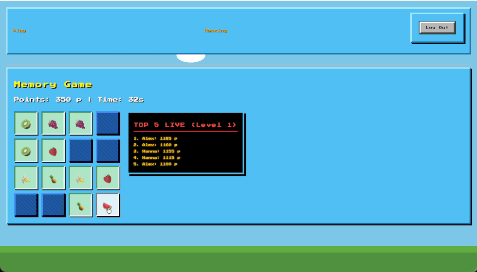

# Memory Game

A browser-based memory game built with TypeScript and Django. Combines client-side game logic with a Django backend 
(authentication, storing results, rankings, API communication). It also includes a live leaderboard implemented with Server-Sent Events.

---
## Features

- **Four difficulty levels** with different board sizes and time limits
- User **registration** and **login**
- Persistent game results
- **Historical leaderboard** with level filtering and sorting
- **Live Top 5** leaderboard for the current level
- **REST API** for submitting game results
- Server-side validation of submitted scores
- Automated backend **tests**

---
## Game



The game is based on matching pairs of cards within a time limit.

| Level | Board | Pairs | Time |
|------:|:-----:|------:|-----:|
| 1 | 4 × 4 | 8 | 60 s |
| 2 | 4 × 6 | 12 | 90 s |
| 3 | 6 × 6 | 18 | 120 s |
| 4 | 6 × 8 | 24 | 150 s |

Scoring is based on the following rules:

- successful match: +100 points
- mismatch: −25 points
- completing the game adds 10 points for every second remaining
- the score cannot fall below zero

A game ends when all pairs are matched or the timer reaches zero.

---
## Architecture

The application is divided into a **TypeScript frontend** and a **Django backend**.

The frontend is responsible for the interactive part of the game, including card state, matching, scoring and the timer.

The backend handles user authentication, persistence and ranking-related functionality.

---
## Backend

The backend is implemented using **Django** and **Django REST Framework**.

Game results are submitted through:

```text
POST /api/results/
```

The endpoint requires an authenticated user. The user associated with a result is taken from the authenticated session rather than from the request body.

Submitted scores are also validated on the backend. The server rejects negative scores and scores exceeding the maximum possible score for the selected level.

The current Top 5 results for a level can be retrieved through:

```text
GET /api/ranking/<level>/
```

---
## Live Ranking

The game includes a live leaderboard showing the current Top 5 results for the selected level.

The browser connects to:

```text
/api/ranking/stream/<level>/
```

using `EventSource`. The server keeps the connection open and periodically sends the current ranking to the client 
using Server-Sent Events.

SSE was used because the required communication is one-way: the server needs to push ranking updates to the browser, 
while the browser does not need to send messages through the same connection.

---
## Historical Ranking

The application also provides a separate historical ranking page.

Results can be:

- filtered by level,
- sorted by points,
- sorted by player name,
- sorted by date,
- sorted in ascending or descending order.

The page displays the **top 10 results** after applying the selected filtering and sorting options.

---
## Testing

The backend includes automated tests for the game-results API and ranking functionality.

The tests cover authentication, request validation, score validation, result ownership, ranking limits, 
level filtering and sorting behaviour.

Run the test suite with:

```bash
uv run python manage.py test
```

---
## Project Structure

```text
MemoryGame/
├── game/
│   ├── migrations/
│   ├── static/
│   ├── templates/
│   ├── constants.py
│   ├── forms.py
│   ├── models.py
│   ├── serializers.py
│   ├── tests.py
│   ├── urls.py
│   └── views.py
│
├── frontend/
│   ├── src/
│   │   ├── Board.ts
│   │   ├── config.ts
│   │   ├── game.ts
│   │   └── main.ts
│   ├── package.json
│   └── tsconfig.json
│
├── memory_project/
│   ├── settings.py
│   └── urls.py
│
├── .env.example
├── manage.py
├── pyproject.toml
├── uv.lock
└── .python-version
```
---
## Technologies used 

**Frontend**

- TypeScript
- HTML
- CSS
- esbuild

**Backend**

- Python
- Django
- Django REST Framework
- SQLite
- Django ORM

**Communication**

- REST API
- Server-Sent Events

**Tooling**

- uv
- Git
- GitHub

---
## Running Locally

### 1. Clone the repository

```bash
git clone https://github.com/hanna-kaliszuk/MemoryGame.git
cd MemoryGame
```

### 2. Configure environment variables

Create a local `.env` file from the provided example:

```bash
cp .env.example .env
```

Generate a new Django secret key:

```bash
uv run python -c "from django.core.management.utils import get_random_secret_key; print(get_random_secret_key())"
```

Copy the generated key into `.env`:

```env
SECRET_KEY=your-generated-secret-key
```

The `.env` file is ignored by Git and should not be committed.

### 3. Install Python dependencies

```bash
uv sync
```

### 4. Apply database migrations

```bash
uv run python manage.py migrate
```

### 5. Install frontend dependencies and build the TypeScript application

```bash
cd frontend
npm install
npm run build
cd ..
```

### 6. Start the Django development server

```bash
uv run python manage.py runserver
```

The application will then be available at:

```text
http://127.0.0.1:8000/
```
---
## Context

This project is an improved version of the final project developed as part of the Web Applications course at the 
University of Warsaw. It is intended for educational purposes and local development rather than production deployment.

The main goal was to build a complete web application and gain practical experience with Django, REST APIs, 
authentication, database persistence, TypeScript and server-to-client communication using Server-Sent Events.
